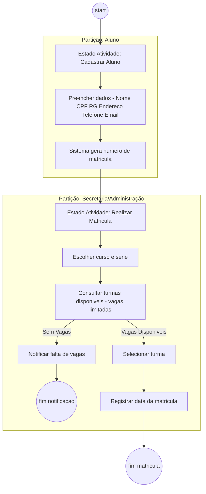

# Diagramas

```mermaid
  graph TD
    start((start)) --> CadastrarAluno[Estado Atividade: Cadastrar Aluno];

    subgraph Partição: Aluno
        CadastrarAluno --> PreencherDadosAluno[Preencher dados - Nome CPF RG Endereco Telefone Email];
        PreencherDadosAluno --> SistemaGeraMatricula[Sistema gera numero de matricula];
    end

    SistemaGeraMatricula --> RealizarMatricula[Estado Atividade: Realizar Matricula];

    subgraph Partição: Secretaria/Administração
        RealizarMatricula --> EscolherCursoESerie[Escolher curso e serie];
        EscolherCursoESerie --> ConsultarTurmasDisponiveis[Consultar turmas disponiveis - vagas limitadas];
        ConsultarTurmasDisponiveis -- Vagas Disponiveis --> SelecionarTurma[Selecionar turma];
        ConsultarTurmasDisponiveis -- Sem Vagas --> NotificarSemVagas[Notificar falta de vagas];
        NotificarSemVagas --> fimNotificacao((fim notificacao));
        SelecionarTurma --> RegistrarDataMatricula[Registrar data da matricula];
    end

    RegistrarDataMatricula --> fimMatricula((fim matricula));


```
